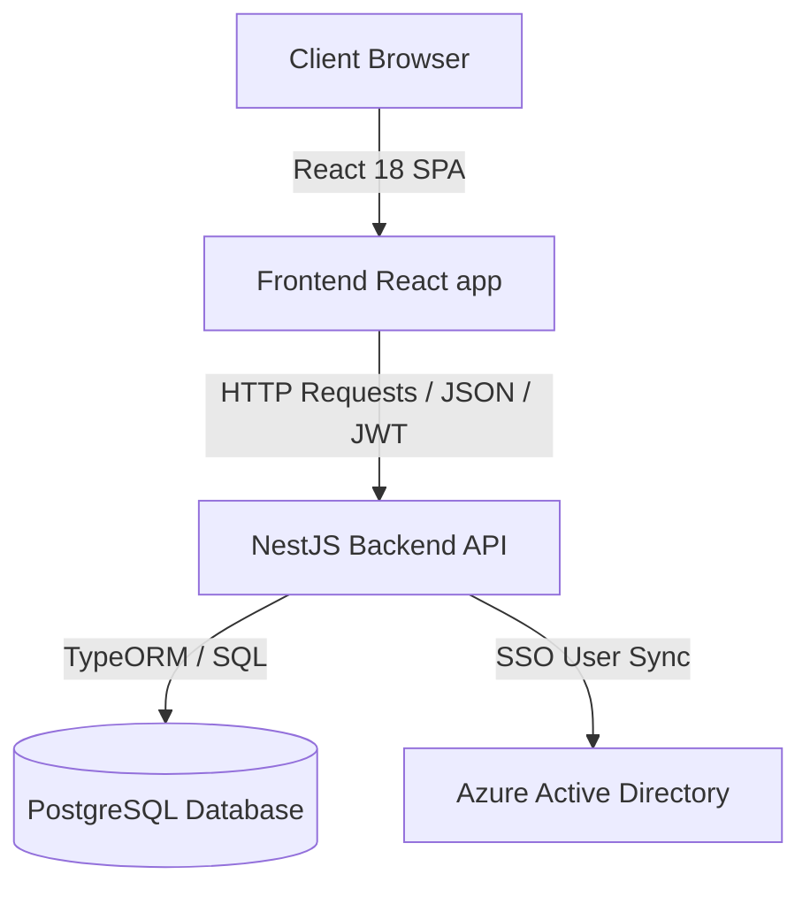
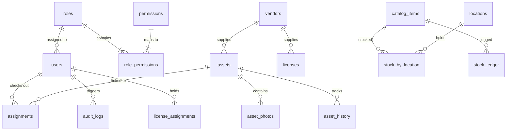

# 🏢 IT Asset Management (ITAM) - Complete Project Analysis & Guide

Welcome to the **IT Asset Management System** developer guide and architecture blueprint. This document provides a structural breakdown, database relationships, module dependencies, and execution flow of the application to serve as a comprehensive onboarding guide.

---

## 📌 1. Project Overview & Architecture

The ITAM system is designed as a **decoupled Full-Stack Web Application** using a modern, scalable architecture:



- **Backend**: built on **NestJS**, a progressive Node.js framework using TypeScript, structure is modular and controller-service oriented.
- **Frontend**: built on **React 18** with **TypeScript**, **TailwindCSS** for styles, **Radix UI** primitives, and **React Router v6** for client-side routing.
- **Database**: **PostgreSQL**, with tables mapped using **TypeORM** decorators on the backend.

---

## 🛠️ 2. Detailed Directory Structure

Below is the directory structure highlighting the role of each directory:

```text
IT-Asset-Management/
├── backend/                        # NestJS backend application
│   ├── src/
│   │   ├── analytics/              # Aggregated dashboard metrics & charts
│   │   ├── asset-units/            # Components & serialized item tracking
│   │   ├── assets/                 # Core hardware assets (Laptops, Servers, etc.)
│   │   ├── assignments/            # Allocation logic for assets & catalog items
│   │   ├── audit-events/           # Login, logout, failed login security logging
│   │   ├── audit-logs/             # Automatic row-level DB changes auditing
│   │   ├── auth/                   # JWT & Passport login, password reset flow
│   │   ├── catalog/                # Master items definition catalog (SKUs)
│   │   ├── categories/             # Asset & inventory grouping categories
│   │   ├── config/                 # NestJS ConfigModule options
│   │   ├── consumable-inventory/   # Consumables, purchases, returns, stock transactions
│   │   ├── departments/            # Cost centers & department details
│   │   ├── entities/               # All TypeORM Entity class declarations
│   │   ├── licenses/               # Software seats, cloud modes, renewals
│   │   ├── locations/              # Physical buildings, floors, rooms
│   │   ├── master/                 # System drop-down lookups (brands, conditions, plans)
│   │   ├── migrations/             # TypeORM DB migration files
│   │   ├── rbac/                   # Role-Based Access Control logic
│   │   ├── reports/                # Report generation (Excel/CSV/Visuals)
│   │   ├── stock/                  # Location-based stock counting & ledger tracking
│   │   ├── users/                  # User records and profiles
│   │   ├── main.ts                 # Bootstrap backend entry point
│   │   └── seed-*.ts               # Database seed scripts for development
│   └── package.json
├── frontend/                       # React frontend SPA
│   ├── src/
│   │   ├── components/             # React components grouped by module
│   │   │   ├── Admin/              # Master tables management pages
│   │   │   ├── Assets/             # Assets list, details, check-in/out UI
│   │   │   ├── ConsumableInventory/# Consumables dashboard & category tables
│   │   │   ├── Dashboard/          # KPI cards and overview
│   │   │   ├── layout/             # Navigation layout, sidebar, shell
│   │   │   └── ui/                 # Shared UI elements
│   │   ├── context/                # Global state (Toasts, Currencies, Auth)
│   │   ├── hooks/                  # Custom hooks (e.g. useAuth, useFetch)
│   │   ├── services/               # REST API client services using Axios
│   │   ├── styles/                 # Global styles and Tailwind configs
│   │   └── App.tsx                 # Client router definition and app bootstrap
│   └── package.json
├── database/                       # Raw SQL scripts and test queries
│   └── init.sql                    # Initial DB creation script
└── docs/                           # Project guides and documentation
```

---

## 🗄️ 3. Database Schema & Data Relationships

The database is built on **PostgreSQL**. The diagram below demonstrates relationships between core tables:



### Table Categories and Functions
1. **RBAC & Identity**:
   - `users`: Standard user login details, role connections, Azure AD GUIDs, and token versions.
   - `roles` & `permissions`: Permission list (e.g., `ASSETS_CREATE`, `LICENSES_VIEW`) and mappings.
2. **Assets Management**:
   - `assets`: Primary catalog of physical equipment with depreciation attributes (`useful_life_years`, `salvage_value`), status, and active user assignment.
   - `asset_history`: Row change audit entries tracking modifications over time.
3. **Consumable Inventory**:
   - `catalog_items`: Bulk inventory definitions, track methods, and policies.
   - `stock_by_location`: Current quantitative totals by site.
   - `stock_ledger`: Immutable ledger tracking every unit added or removed.
4. **License Management**:
   - `licenses`: SaaS and on-prem software seats, costs, and tenant configs.
   - `license_assignments`: Associates seats with target users or hardware assets.

---

## 🚦 4. Key Functional Modules

### 1. Asset Lifecycle Tracking
- **Flow**: Procurement (available) ➔ Deployment (assigned to a user or department) ➔ Maintenance (broken/repair) ➔ Disposal (retired/sold).
- **Depreciation**: Auto-calculates current asset values based on initial purchase cost, age, and salvage value.

### 2. Software License Compliance
- Monitors seat capacity (assigned seats vs total seats purchased).
- Triggers alerts for upcoming expiration or over-allocation.
- Integrates with Azure/AWS tenants for automated license synchronizations.

### 3. Catalog & Ledger-Based Inventory
- Divides items into **Serialized** (unique tags) and **Bulk** (high quantity consumables).
- Every addition, subtraction, or relocation writes to the append-only `stock_ledger` table to prevent inventory shrinkage and provide a solid audit trail.

---

## 🧭 5. App Flow & Navigation Paths

The frontend layout uses a React App Shell with role-based routing controls:

| Path | Screen / Page Component | Purpose / Function |
| :--- | :--- | :--- |
| `/login` | `Login.tsx` | JWT sign-in screen |
| `/dashboard` | `DashboardHome.tsx` | KPI dashboards, active checkouts, & analytics |
| `/dashboard/assets` | `AssetManagement.tsx` | Hardware list, filter, purchase toggle |
| `/dashboard/licenses` | `LicenseManagement.tsx`| SaaS & subscription lists and renewal alerts |
| `/dashboard/inventory`| `InventoryManagementModule.tsx`| Bulk consumables, reorder alerts, category maps |
| `/dashboard/catalog` | `CatalogPage.tsx` | Inventory templates directory & SKU configurations |
| `/dashboard/stock` | `StockPage.tsx` | Visual counts across warehouse sites |
| `/dashboard/audit` | `AuditPage.tsx` | Manual counts entry & automated mismatch adjustment |
| `/dashboard/admin/*` | `RoleMaster.tsx`, `PermissionMaster.tsx` | RBAC controls and Master Tables (Brands, Vendors, Cond.) |

---

## 🚀 6. Developer Guidelines & Seeding

For setting up the environment:

1. **Permissions & Admin Setup**: Run `npm run seed:permissions` or `npm run seed:all` within `backend`.
2. **Development Seed Data**: Seeds mock vendors, brands, categories, catalogs, and dummy users.
3. **API Integrity**: Ensure CORS allows the frontend origin, configure a secure `JWT_SECRET`, and check database logs via the standard `audit_logs` table.
