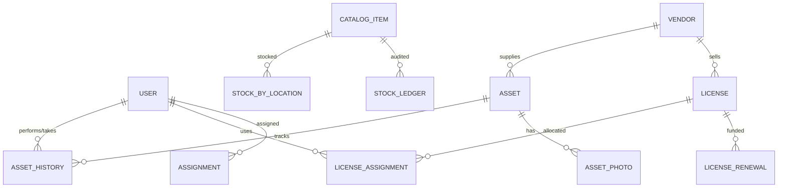

# Complete Database Schema Documentation - IT Asset Management

This document provides a comprehensive overview of the entire database schema for the IT Asset Management system. The system is designed to handle hardware, software, consumables, and broad audit requirements using **TypeORM**.

---

## 1. Identity & Access (RBAC)
Manages authentication, authorization, and security tokens.

### `users`
Core user profile table. Supports local auth and Azure AD linking.
- `id`: Primary Key.
- `email`: Unique login identifier.
- `password_hash`: Bcrypt hashed password.
- `first_name`, `last_name`: Personal details.
- `role_id`: FK to `roles`.
- `azure_id`: Unique identifier for SSO.
- `is_active`, `is_verified`: Account state flags.
- `token_version`: Used for global logout/refresh token invalidation.

### `roles` & `permissions`
- **`roles`**: Defines access levels (Admin, Manager, User).
- **`permissions`**: Specific actions (e.g., `ASSETS_CREATE`).
- **`role_permissions`**: Junction table mapping roles to multiple permissions.

---

## 2. Organization & Master Data
Static or semi-static data used to categorize and locate assets.

- **`departments`**: Organizational units with `costCenter` tracking.
- **`locations`**: Physical sites with building, floor, and room details.
- **`vendors`**: Suppliers for both hardware and software licenses.
- **`brands`**: Manufacturers (Apple, Dell, etc.).
- **`categories`**: High-level groupings (Laptops, Licenses, Peripherals).
- **`lookups`**: General-purpose key-value store for dropdown configurations.

---

## 3. Hardware Asset Management
Lifecycle tracking for serialized physical devices.

### `assets`
The main table for significant hardware (Laptops, Servers, Monitors).
- `asset_tag`: Unique physical ID.
- `serial_number`: Manufacturer serial.
- `status`: Enum (Available, Deployed, Maintenance, Disposed).
- `assigned_to_id`: FK to `users` for active checkout.
- `purchase_date`, `purchase_cost`, `warranty_expiry`: Financial details.
- `useful_life_years`, `salvage_value`: Depreciation parameters.

### `asset_history`
Chronological log of every action performed on an asset.
- `action`: Created, Updated, Checkout, Checkin, Maintenance.
- `changes`: JSONB field storing "before/after" state.

### `asset_units` & `asset_photos`
- **`asset_units`**: Tracking for components within a main asset.
- **`asset_photos`**: Image storage links for physical condition proof.

---

## 4. Product Catalog & Bulk Inventory
Handles high-volume, non-serialized items (Mice, Keyboards, Toners).

### `catalog_items`
Definitions of items that can be stocked.
- `sku`: Unique Stock Keeping Unit.
- `trackMode`: Enum (SERIALIZED vs BULK_QTY).
- `returnPolicy`: Enum (Returnable, Consumable, Assign-Once).

### `stock_by_location`
Current real-time balances for bulk items.
- `quantity`: Current count at a specific `location_id`.
- *Constraint*: Must be >= 0.

### `stock_ledger`
**Append-only immutable ledger** recording every movement.
- `quantityChange`: Numeric difference (e.g., +10 for procurement, -1 for issue).
- `runningBalance`: Point-in-time balance after the entry.
- `reason`: Enum (Procurement, Issue, Return, Adjustment).

---

## 5. Software License Management
Tracks SaaS and on-premise software compliance.

### `licenses`
- `software_name`: Display name.
- `total_seats`, `used_seats`: Capacity tracking.
- `expiry_date`: Renewal monitoring.
- `cloud_mode`: Boolean (Cloud vs On-prem).
- `tenant_id`: Account/Subscription ID (AWS/Azure).

### `license_assignments` & `license_renewals`
- **`license_assignments`**: Links a license seat to a `User` or `Asset`.
- **`license_renewals`**: History of payment and extension events.

---

## 6. Assignments & Transactions
Tracks the movement of items between stock and staff.

- **`assignments`**: General record of checking out assets or inventory.
- **`inventory_purchases`**: Inbound stock from vendors (GRN).
- **`inventory_returns`**: Log of items returned by employees.

---

## 7. Audit System
System-wide activity monitoring.

- **`audit_logs`**: Automated entity-level change tracking (Table, Row ID, Old Data, New Data).
- **`audit_events`**: Security events (Logins, Failed attempts, Password resets).
- **`inventory_audit`**: Periodic physical stock count verification records.

---

## Relationship Diagram (ERD)

